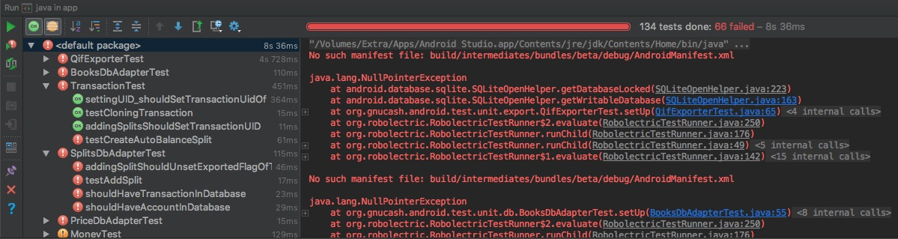

# Reporte MDroid+

En este reporte se presentan la ejecución de la suite de pruebas de los 10 mutantes seleccionados, además de un monkey sobre los mutantes.

Los mutantes seleccionados son: 91, 182, 273, 364, 455, 546, 637, 728, 819, 910.

## Ejecución pruebas

De entrada se sabe que 66 tests unitarios fallan. Por lo que no se tendrán en cuenta:


El monkey se corrió con el comand: `adb shell monkey -p org.gnucash.android -v -s 1234 --ignore-security-exceptions --kill-process-after-error --monitor-native-crashes 10000`

### Mutante 1 - 91
Cambio en: app/src/main/java/org/gnucash/android/ui/passcode/KeyboardFragment.java

66 tests fallando. **sobreviviente**

Monkey murió por error del sistema, no de la app:
```sh
** Error: A RuntimeException occurred:
java.lang.RuntimeException: android.os.DeadSystemException
	at android.hardware.input.InputManager.injectInputEvent(InputManager.java:870)
	at com.android.commands.monkey.MonkeyKeyEvent.injectEvent(MonkeyKeyEvent.java:133)
	at com.android.commands.monkey.Monkey.runMonkeyCycles(Monkey.java:1156)
	at com.android.commands.monkey.Monkey.run(Monkey.java:652)
	at com.android.commands.monkey.Monkey.main(Monkey.java:512)
	at com.android.internal.os.RuntimeInit.nativeFinishInit(Native Method)
	at com.android.internal.os.RuntimeInit.main(RuntimeInit.java:284)
Caused by: android.os.DeadSystemException
	... 7 more
```

**Muerto por error de sistema**

### Mutante 2 - 182
Cambio en: app/src/main/res/values/strings.xml

66 tests fallando.

**sobreviviente**

Monkey no murió.

**sobreviviente**

### Mutante 3 - 273
Cambio en: app/src/main/res/values/strings.xml

66 tests fallando.

**sobreviviente**

Monkey no murió.

**sobreviviente**

### Mutante 4 - 364
Cambio en: app/src/main/res/values/strings.xml

66 tests fallando.

**sobreviviente**

Monkey no murió.

**sobreviviente**

### Mutante 5 - 455
Cambio en: app/src/main/res/values/strings.xml

66 tests fallando.

**sobreviviente**

Monkey no murió.

**sobreviviente**

### Mutante 6 - 546
Cambio en: app/src/main/java/org/gnucash/android/ui/account/DeleteAccountDialogFragment.java

66 tests fallando.

**sobreviviente**

Monkey no murió.

**sobreviviente**

### Mutante 7 - 637
Cabmio en: app/src/main/java/org/gnucash/android/ui/transaction/ScheduledActionsListFragment.java

66 tests fallando.

**sobreviviente**

Monkey no murió.

**sobreviviente**

### Mutante 8 - 728
Cambio en: app/src/main/java/org/gnucash/android/ui/homescreen/WidgetConfigurationActivity.java

66 tests fallando.

**sobreviviente**

Monkey no murió.

**sobreviviente**

### Mutante 9 - 819
Cambio en: app/src/main/java/org/gnucash/android/ui/report/sheet/BalanceSheetFragment.java

66 tests fallando.

**sobreviviente**

Monkey no murió.

**sobreviviente**

### Mutante 10 - 910
Cambio en: app/src/main/java/org/gnucash/android/db/MigrationHelper.java

66 tests fallando.

**sobreviviente**

Monkey no murió.

**sobreviviente**

## Conclusiones
Todos los mutantes sobrevivieron. El suite de pruebas podría extenderse y al menos asegurar que los tests que están funcionan.
